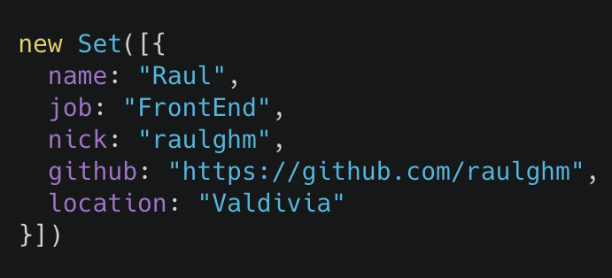

title: Vue + Parcel
author:
  name: Raúl Hernández
  twitter: raulghm
  url: https://github.com/raulghm
output: index.html
controls: true
style: style.css
theme: juanbrujo/cleaver-beerjs

--

# Vue + Parcel 👌
## El nuevo chico Zero-config

--



--

# [beerjs.cl/valdivia](http://beerjs.cl/valdivia)


--

# Rayün


--

# 🤔

## https://github.com/parcel-bundler/parcel ⭐️ 21.069

--

# Webpack en el 2018


--

# Features

* 🚀 Blazing fast bundle times
* 📦 Out of the box support for JS, CSS, HTML, file assets, and more
* 🐠 Automatically transforms modules using Babel, PostCSS, and PostHTML when needed
* ✂️ Zero configuration code splitting
* 🔥 Hot module replacement, (aka HMR)
* 🚨 Friendly error logging experience

--

# Benchmarks

* Based on a reasonably sized app
* Containing 1726 modules, 6.5M uncompressed.
* Built on a 2016 MacBook Pro with 4 physical CPUs.


--

# Getting started 🏁

--

# 1️⃣  Install

```
yarn global add parcel-bundler
```

--

# 2️⃣  Configure a entry file
## JS, HTML, CSS...

```html
<html>
<body>
  <script src="./index.js"></script>
</body>
</html>
```

--

# 3️⃣  Start developmennt

```
parcel index.html
```

--

# 4️⃣ Open

```
http://localhost:1234
```

--

# 3️⃣  Build for production

```
parcel build index.html
```

--

# Other commands ✨

```
parcel serve index.html
parcel watch index.html
parcel help
```

--

# Parcel + Vue = 😍


--

# Parcel 1.7.0

## Features

* 🖖 Zero config Vue support (.vue components)
* 💰 Content hashed bundle names for long-term caching
* 🕵️ Faster resolver supporting aliases, absolute and tilde paths. `/path` `~/src/path`
* 🕵 Automagically install missing dependencies in your code. `import mutable from mutable`
* 🐶 Pug and Jade support
* 🚨 HMR error overlay

https://github.com/parcel-bundler/parcel/blob/master/changelog.md#170---2018-03-28
https://medium.com/@devongovett/parcel-v1-7-0-9aac0c505837

--

# Automagically install missing dependencies ⚡️


## Disable autoinstall `parcel --no-autoinstall` 👀

--

# Webpack -> Parcel 📦
## vuejs-templates/webpack -> parcel

* Crear o modificar `package.json`

```
{
  "main": "index.js",
  "scripts": {
    "start": "parcel index.html"
  },
  "dependencies": {
    "eslint": "^4.19.1",
    "vue": "^2.5.16"
  },
  "devDependencies": {
    "@vue/component-compiler-utils": "^1.0.0",
    "eslint-plugin-vue": "^4.4.0",
    "vue-template-compiler": "^2.5.16"
  }
}

```

* Copiar exactamente la misma estructura de carpetas de `/src`
* Modificar index.html incluyendo `main.js`
* Eliminar prefijos `@/Componentes/Foo` y cambiar por `./Components/Foo` o `/src/Components/Foo`
* Instalar dependencias a mano o no hacer nada y esperar _autoinstall_

--

# Webpack -> Parcel 📦
## Environment variables
https://github.com/motdotla/dotenv

.env
```
FOO=bar
BEER=JS
```

.js
```
process.env.BEER
```

--

# Recursos

* https://parceljs.org
* https://github.com/raulghm/vue-parcel

--

# Gracias ❤️
